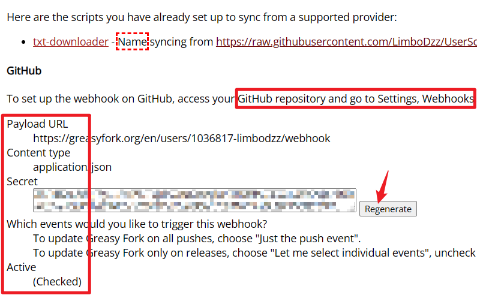
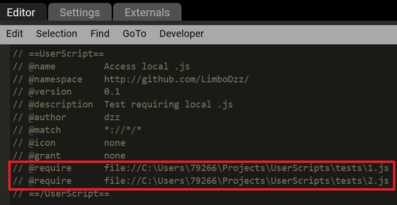

## Contents

- [x] [txt-downloader](./txt-downloader/)

## What I've learnt

### 2 ways to write userscripts in vscode

1.  Webhook

    1. Sign in Greasy Fork
    1. User control panel - setup webhook
       
    1. Publish script - Go to Admin - Source Syncing - Provide github raw url of your js file
       

2.  Require local js file

    1. Allow access to file url in your browser

    2. Add @require in metadata
       
